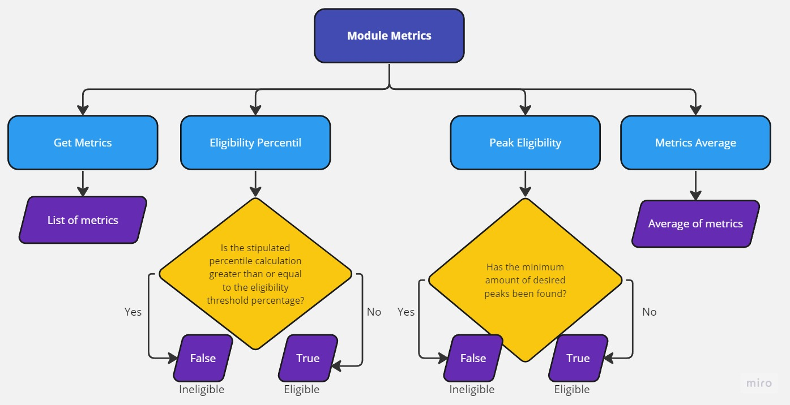

# Module Metrics 
Module responsible for fetching metrics from resources in the Azure Cloud. Returns a list of metrics, tests eligibility using percentile calculation or peak comparison, and also averages the total metrics for possible scaling. 

## **Requirements**
- [Python 3.10 or higher](https://www.python.org/downloads/)

## **Installing Dependencies**
```cmd
poetry install
```

## **Authentication**
This is a Python class that contains methods for managing resources and tags in Azure using the Azure SDK.Additionally,
it uses env variable for get credentials 

- Export variables :
    ```txt
    AZURE_CLIENT_ID="..."
    AZURE_CLIENT_SECRET="..."
    AZURE_TENANT_ID="..."
- Or through **.secrets.toml** file at the your project's root path:
    ```txt
    CLIENT_ID=""
    CLIENT_SECRET=""
    TENANT_ID=""

## **Classes**

### *Services*

```python3
class AzureMetricsService()
```
#### Methods:

#### *get_metrics_azure*
```python3
def get_metrics_azure(
    self, 
    metricname: str, 
    sub_id:str, 
    resource_id: str, 
    start_time: str, 
    end_time: str, 
    interval: str, 
    aggregation: str
)
```
Lists all metrics for a resource within the given time.

**Parameters:**

| Name | Type | Description | Default |
|---|---|---|---|
| metricname | str | Name of the metric being monitored for a given resource on the Azure platform.  | str |
| sub_id | str | The subscription ID for which the resource groups will be listed. | str |
| resource_id | str | Unique identifier for a particular resource on the Azure platform. | str |
| start_time | str | Specifies the time when metrics collection should start. It indicates the starting point in time for the analysis of a given resource on the Azure platform. | str |
| resource_id | str | Specifies the time when metrics collection should stop. It indicates the end time of analysis completion for a given resource on the Azure platform. | str |
| interval | str | Specify the time interval for collecting metrics or logs for a given resource on the Azure platform. | str |
| aggregation | str | Specifies the aggregation method used to calculate metrics for a given resource on the Azure platform. It indicates how the collected metrics are grouped and summarized to present a more readable and useful data set. | str |

-----------------------------

#### *metrics_average*
```python3
def metrics_average(
    self, 
    metricname: str, 
    sub_id:str, 
    resource_id: str, 
    start_time: str, 
    end_time: str, 
    interval: str, 
    aggregation: str
)
```
Retrieves the average value of a given metric for a specified Azure resource.

**Parameters:**

| Name | Type | Description | Default |
|---|---|---|---|
| metricname | str | Name of the metric being monitored for a given resource on the Azure platform.  | str |
| sub_id | str | The subscription ID for which the resource groups will be listed. | str |
| resource_id | str | Unique identifier for a particular resource on the Azure platform. | str |
| start_time | str | Specifies the time when metrics collection should start. It indicates the starting point in time for the analysis of a given resource on the Azure platform. | str |
| resource_id | str | Specifies the time when metrics collection should stop. It indicates the end time of analysis completion for a given resource on the Azure platform. | str |
| interval | str | Specify the time interval for collecting metrics or logs for a given resource on the Azure platform. | str |
| aggregation | str | Specifies the aggregation method used to calculate metrics for a given resource on the Azure platform. It indicates how the collected metrics are grouped and summarized to present a more readable and useful data set. | str |
---------

#### *peak_eligibility*
```python3
def peak_eligibility(
    self, 
    metricname: str, 
    sub_id:str, 
    resource_id: str, 
    start_time: str, 
    end_time: str, 
    interval: str, 
    aggregation: str,
    usage_peak: int, 
    percentage= 20
)
```
Determines if the given Azure resource has exceeded the specified usage peak percentage.

**Parameters:**

| Name | Type | Description | Default |
|---|---|---|---|
| metricname | str | Name of the metric being monitored for a given resource on the Azure platform.  | str |
| sub_id | str | The subscription ID for which the resource groups will be listed. | str |
| resource_id | str | Unique identifier for a particular resource on the Azure platform. | str |
| start_time | str | Specifies the time when metrics collection should start. It indicates the starting point in time for the analysis of a given resource on the Azure platform. | str |
| resource_id | str | Specifies the time when metrics collection should stop. It indicates the end time of analysis completion for a given resource on the Azure platform. | str |
| interval | str | Specify the time interval for collecting metrics or logs for a given resource on the Azure platform. | str |
| aggregation | str | Specifies the aggregation method used to calculate metrics for a given resource on the Azure platform. It indicates how the collected metrics are grouped and summarized to present a more readable and useful data set. | str |
| usage_peak | str | Number of peaks to be collected. | str |
| percentage | str | Proposed minimum percentage of eligibility. | 20 |
---------

#### *eligibility_percentil*
```python3
def eligibility_percentile(
    self, 
    metricname: str, 
    sub_id:str, 
    resource_id: str, 
    start_time: str, 
    end_time: str, 
    interval: str, 
    aggregation: str,
    percentile= 95, 
    percentage= 20
)
```
Retrieves the eligibility percentil of a given Azure resource based on the maximum value of the specified metric.

**Parameters:**

| Name | Type | Description | Default |
|---|---|---|---|
| metricname | str | Name of the metric being monitored for a given resource on the Azure platform.  | str |
| sub_id | str | The subscription ID for which the resource groups will be listed. | str |
| resource_id | str | Unique identifier for a particular resource on the Azure platform. | str |
| start_time | str | Specifies the time when metrics collection should start. It indicates the starting point in time for the analysis of a given resource on the Azure platform. | str |
| resource_id | str | Specifies the time when metrics collection should stop. It indicates the end time of analysis completion for a given resource on the Azure platform. | str |
| interval | str | Specify the time interval for collecting metrics or logs for a given resource on the Azure platform. | str |
| aggregation | str | Specifies the aggregation method used to calculate metrics for a given resource on the Azure platform. It indicates how the collected metrics are grouped and summarized to present a more readable and useful data set. | str |
| percentile | str | Measure that indicates the position of a value within a distribution in relation to other values. | 95 |
| percentage | str | Proposed minimum percentage of eligibility. | 20 |
---------
## **Diagram**
<center>



</center>